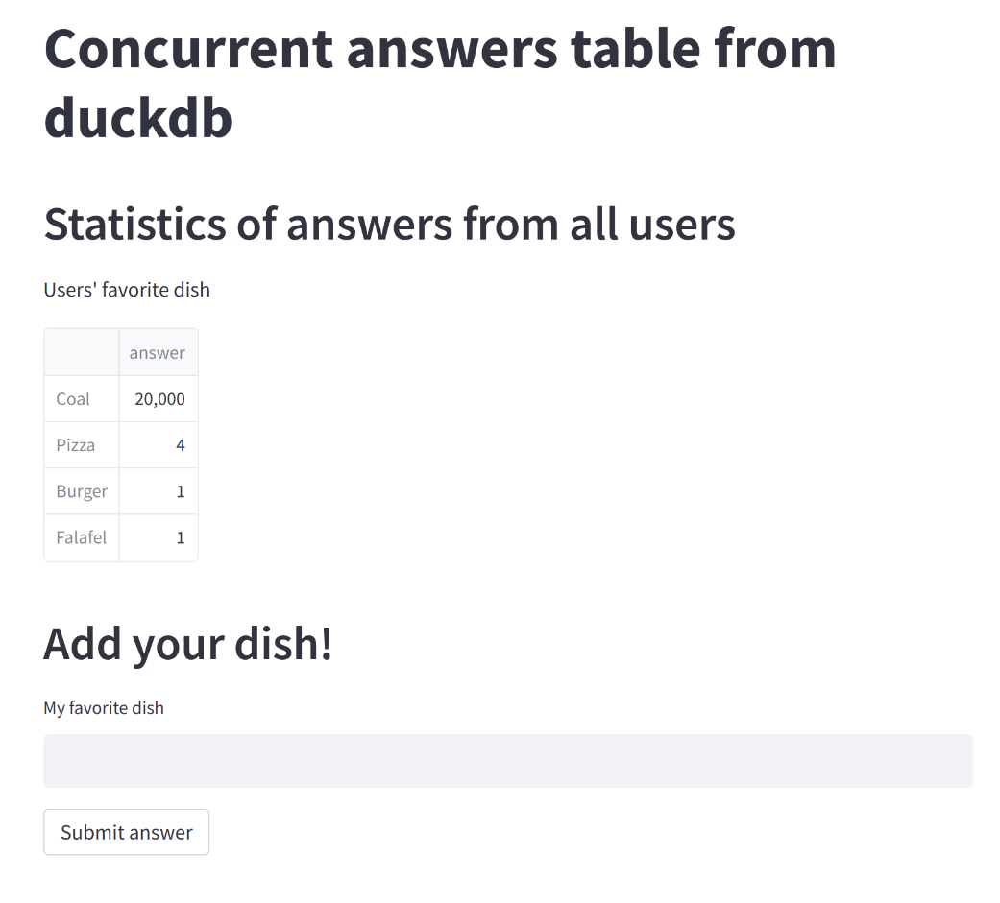

# 1 duck 100 connections

(Failed) Experiment of concurrent reads and writes to sqlite/duckdb with fastapi guard on the way.

Please like [this comment](https://github.com/duckdb/duckdb/issues/77#issuecomment-1116592564) if it bother you as well.

Written under `python=3.10`.

To run it yourself:

1. Create `python=3.10` env and install `requirements.txt`
2. Run `uvicorn backend:app --port=8000`
3. Run `streamlit run main.py`
4. Run `python test_many_connections.py`
5. Try using the streamlit app, it will probably crash if the `test_many_connections.py` script is running.

